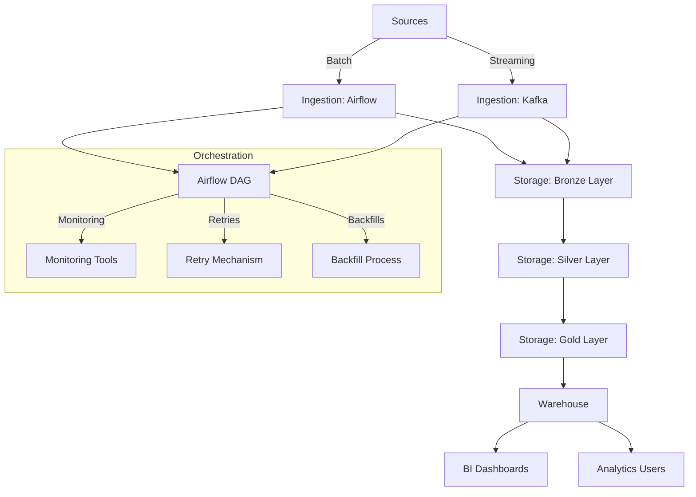

```mermaid
graph TD
    A[Sources] -->|Batch| B[Ingestion: Airflow]
    A -->|Streaming| C[Ingestion: Kafka]
    
    B --> D[Storage: Bronze Layer]
    C --> D

    D --> E[Storage: Silver Layer]
    E --> F[Storage: Gold Layer]

    F --> G[Warehouse]
    
    G --> H[BI Dashboards]
    G --> I[Analytics Users]

    subgraph Orchestration
        J[Airflow DAG] -->|Monitoring| K[Monitoring Tools]
        J -->|Retries| L[Retry Mechanism]
        J -->|Backfills| M[Backfill Process]
    end

    B --> J
    C --> J
```