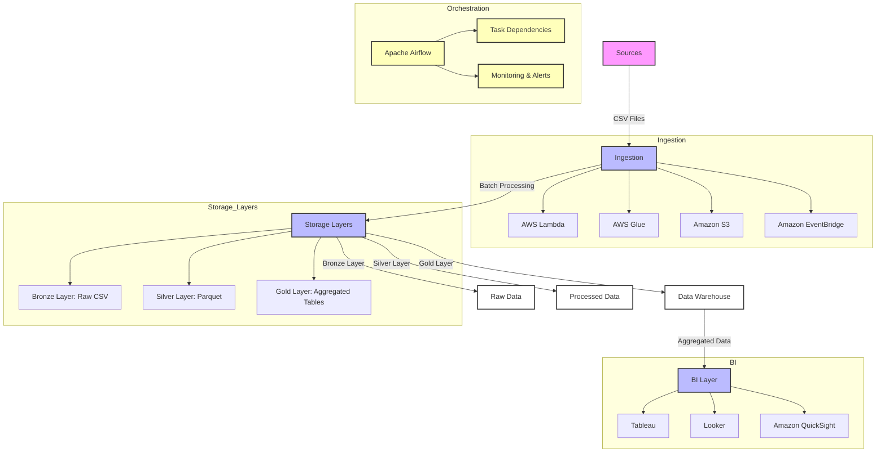

```mermaid
graph TD
    A[Sources] -->|CSV Files| B[Ingestion]
    B -->|Batch Processing| C[Storage Layers]
    C -->|Bronze Layer| D[Raw Data]
    C -->|Silver Layer| E[Processed Data]
    C -->|Gold Layer| F[Data Warehouse]
    F -->|Aggregated Data| G[BI Layer]
    
    subgraph Ingestion
        B1[AWS Lambda]
        B2[AWS Glue]
        B3[Amazon S3]
        B4[Amazon EventBridge]
        B --> B1
        B --> B2
        B --> B3
        B --> B4
    end

    subgraph Storage_Layers
        C1[Bronze Layer: Raw CSV]
        C2[Silver Layer: Parquet]
        C3[Gold Layer: Aggregated Tables]
        C --> C1
        C --> C2
        C --> C3
    end

    subgraph Orchestration
        O1[Apache Airflow]
        O2[Task Dependencies]
        O3[Monitoring & Alerts]
        O1 --> O2
        O1 --> O3
    end

    subgraph BI
        G1[Tableau]
        G2[Looker]
        G3[Amazon QuickSight]
        G --> G1
        G --> G2
        G --> G3
    end

    style A fill:#f9f,stroke:#333,stroke-width:2px;
    style B fill:#bbf,stroke:#333,stroke-width:2px;
    style C fill:#bbf,stroke:#333,stroke-width:2px;
    style D fill:#fff,stroke:#333,stroke-width:2px;
    style E fill:#fff,stroke:#333,stroke-width:2px;
    style F fill:#fff,stroke:#333,stroke-width:2px;
    style G fill:#bbf,stroke:#333,stroke-width:2px;
    style O1 fill:#ffb,stroke:#333,stroke-width:2px;
    style O2 fill:#ffb,stroke:#333,stroke-width:2px;
    style O3 fill:#ffb,stroke:#333,stroke-width:2px;
```