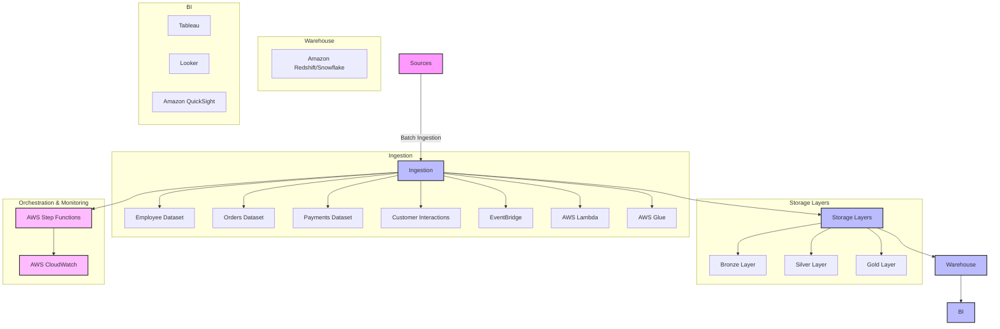

```mermaid
graph TD
    A[Sources] -->|Batch Ingestion| B[Ingestion]
    B --> C[Storage Layers]
    C --> D[Warehouse]
    D --> E[BI]
    
    subgraph Ingestion
        direction TB
        B1[Employee Dataset]
        B2[Orders Dataset]
        B3[Payments Dataset]
        B4[Customer Interactions]
        B5[EventBridge]
        B6[AWS Lambda]
        B7[AWS Glue]
        
        B --> B1
        B --> B2
        B --> B3
        B --> B4
        B --> B5
        B --> B6
        B --> B7
    end

    subgraph Storage Layers
        direction TB
        C1[Bronze Layer]
        C2[Silver Layer]
        C3[Gold Layer]
        
        C --> C1
        C --> C2
        C --> C3
    end

    subgraph Warehouse
        D1[Amazon Redshift/Snowflake]
    end

    subgraph BI
        E1[Tableau]
        E2[Looker]
        E3[Amazon QuickSight]
    end

    subgraph Orchestration & Monitoring
        F[AWS Step Functions]
        G[AWS CloudWatch]
        
        B --> F
        F --> G
    end

    style A fill:#f9f,stroke:#333,stroke-width:2px
    style B fill:#bbf,stroke:#333,stroke-width:2px
    style C fill:#bbf,stroke:#333,stroke-width:2px
    style D fill:#bbf,stroke:#333,stroke-width:2px
    style E fill:#bbf,stroke:#333,stroke-width:2px
    style F fill:#fbf,stroke:#333,stroke-width:2px
    style G fill:#fbf,stroke:#333,stroke-width:2px
```